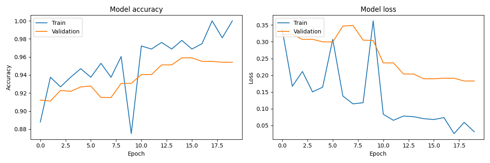

# ECO CLASSIFY - Hệ Thống Phân Loại Rác Thông Minh

ECO CLASSIFY là ứng dụng phân loại rác thải sử dụng trí tuệ nhân tạo, hỗ trợ xác định và phân loại các loại rác bằng thị giác máy tính và công nghệ học sâu.

## Tổng Quan Dự Án

Dự án sử dụng mạng nơ-ron tích chập (MobileNetV2) để phân loại rác thành 10 nhóm khác nhau, kết hợp giao diện web tương tác cho phép phân loại thời gian thực qua webcam hoặc tải ảnh lên.



## Tính Năng

- Phân loại rác thời gian thực qua webcam
- Tải ảnh lên để phân loại rác
- Chọn lại loại rác thủ công khi cần
- Chức năng chụp ảnh từ camera để phân loại
- Thiết kế đáp ứng trên máy tính và thiết bị di động
- Cung cấp thông tin giáo dục về từng nhóm rác và cách xử lý

## Các Nhóm Rác

Hệ thống phân loại rác thành 10 nhóm:

1. **Battery** (rác nguy hại)
2. **Biological** (rác hữu cơ)
3. **Brown Glass** (rác không tái chế)
4. **Cardboard** (rác tái chế)
5. **Green Glass** (rác không tái chế)
6. **Metal** (rác tái chế)
7. **Paper** (rác tái chế)
8. **Plastic** (rác tái chế)
9. **Trash** (rác không tái chế)
10. **White Glass** (rác không tái chế)

## Công Nghệ Sử Dụng

- **Backend**: Python, Flask
- **Machine Learning**: TensorFlow, MobileNetV2 (Transfer Learning)
- **Frontend**: HTML, CSS, JavaScript, Bootstrap
- **Xử lý ảnh**: OpenCV, PIL
- **Xử lý thời gian thực**: Streaming response của Flask, fetch API của JavaScript

## Cấu Trúc Dự Án

```
ECO CLASSIFY/
├── app.py                      # Ứng dụng Flask chính
├── train_model.py              # Script huấn luyện mô hình
├── requirements.txt            # Thư viện Python cần thiết
├── app.log                     # File log ứng dụng
├── prediction_stats.json       # Thống kê đánh giá mô hình
├── README.md                   # Tài liệu dự án
├── TrainingGuide.md            # Hướng dẫn huấn luyện mô hình
├── app/                        # Thư mục ứng dụng web
│   ├── static/                 # Tài nguyên tĩnh
│   │   ├── css/
│   │   │   └── style.css       # Stylesheet
│   │   ├── js/
│   │   │   └── script.js       # JavaScript
│   │   └── uploads/            # Ảnh tải lên
│   └── templates/
│       └── index.html          # Trang chính
├── model/                      # File mô hình
│   ├── class_names.txt         # Tên lớp phân loại
│   ├── training_history.png    # Biểu đồ kết quả huấn luyện
│   └── trash_classification_model.h5  # Mô hình đã huấn luyện
└── rubbish-data/               # Dữ liệu huấn luyện (không có trong repo)
    ├── train/                  # Tập huấn luyện
    ├── val/                    # Tập xác thực
    └── test/                   # Tập kiểm thử
```

## Cài Đặt và Sử Dụng

### Yêu Cầu

- Python 3.10.x
- Webcam để phân loại thời gian thực
- TensorFlow 2.x và các phụ thuộc

### Cài Đặt

1. Clone repository hoặc tải mã nguồn xuống
2. Cài đặt thư viện:

```bash
pip install -r requirements.txt
```

3. Đảm bảo đã có mô hình huấn luyện trong thư mục `model/` hoặc tham khảo hướng dẫn huấn luyện

### Chạy Ứng Dụng

```bash
python app.py
```

Mở trình duyệt và truy cập: `http://localhost:5000`

## Huấn Luyện Mô Hình

Xem hướng dẫn chi tiết tại [TrainingGuide.md](TrainingGuide.md)

## Hiệu Suất

Mô hình đạt khoảng 85-90% độ chính xác trên tập kiểm thử, tùy thuộc chất lượng ảnh và điều kiện ánh sáng.

## Phát Triển Thêm

- Hỗ trợ đa ngôn ngữ
- Tài khoản người dùng để theo dõi thói quen phân loại
- Ứng dụng di động (iOS/Android)
- Tích hợp gamification để khuyến khích phân loại đúng cách
- Kết nối với thùng rác thông minh và thiết bị IoT


- Dữ liệu tham khảo từ các bộ ảnh phân loại rác công khai kaggle
- Kiến trúc MobileNetV2 của Google
- Icon và giao diện từ Font Awesome và Bootstrap
